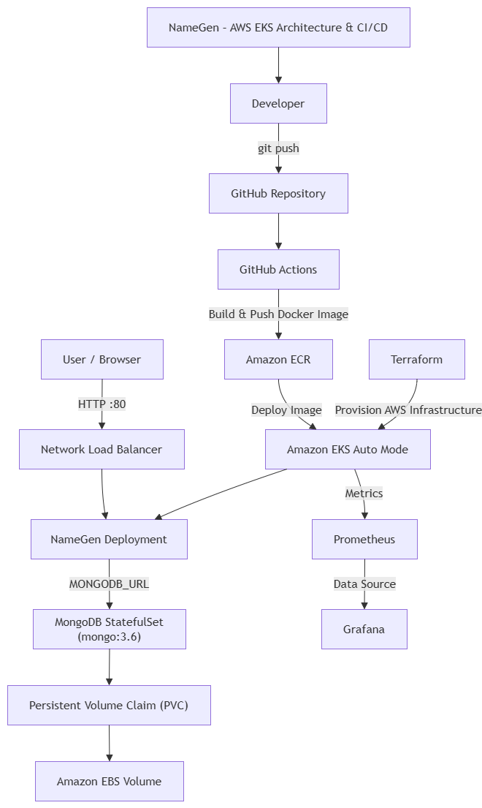

# NameGen – AWS EKS DevOps Final Project

## Overview

This project demonstrates a complete DevOps workflow for deploying a containerized Random Name Generator and Saver application on Amazon Web Services.

The application is deployed to an Amazon EKS Auto Mode cluster and uses MongoDB for persistent storage. Infrastructure is provisioned with Terraform, application images are stored in Amazon ECR, and GitHub Actions provides an automated CI/CD pipeline.

The application is publicly exposed through an AWS Network Load Balancer (NLB), while Prometheus and Grafana provide Kubernetes monitoring and visualization.

---

## Architecture



The architecture includes:

- Terraform for infrastructure provisioning
- Amazon EKS Auto Mode
- Amazon ECR for Docker images
- GitHub Actions CI/CD
- AWS Network Load Balancer
- NameGen Kubernetes Deployment
- MongoDB StatefulSet
- Persistent Volume Claim backed by Amazon EBS
- Prometheus
- Grafana

The editable draw.io architecture file is available here:

```text
diagrams/namegen-architecture-cicd.drawio
```

---

## Technology Stack

| Technology | Purpose |
|---|---|
| AWS | Cloud platform |
| Amazon EKS Auto Mode | Kubernetes cluster |
| Terraform | Infrastructure as Code |
| Docker | Application containerization |
| Amazon ECR | Docker image registry |
| Kubernetes | Container orchestration |
| MongoDB 3.6 | Application database |
| Amazon EBS | Persistent MongoDB storage |
| AWS Network Load Balancer | Public application access |
| GitHub Actions | CI/CD automation |
| GitHub OIDC | Secure AWS authentication |
| Prometheus | Metrics collection |
| Grafana | Monitoring dashboards |
| Helm | Monitoring stack installation |

---

## Repository Structure

```text
namegen/
├── .github/
│   └── workflows/
│       └── deploy.yml
│
├── diagrams/
│   ├── namegen-architecture-cicd.drawio
│   └── namegen-architecture-cicd.png
│
├── kubernetes/
│   ├── mongodb-init-configmap.yaml
│   ├── mongodb-secret.example.yaml
│   ├── mongodb-service.yaml
│   ├── mongodb-statefulset.yaml
│   ├── namegen-deployment.yaml
│   ├── namegen-service.yaml
│   └── storageclass.yaml
│
├── screenshots/
│   ├── 01-docker-mongodb-persistence.png
│   ├── ...
│   └── 17-grafana-namegen-mongodb-monitoring.png
│
├── terraform/
│   ├── versions.tf
│   ├── variables.tf
│   ├── provider.tf
│   ├── network.tf
│   ├── iam.tf
│   └── eks.tf
│
├── Dockerfile
├── package.json
├── server.js
└── README.md
```

---

# Infrastructure

## Terraform

Terraform is used to provision the AWS infrastructure required by the project.

The Terraform configuration creates the networking and Amazon EKS infrastructure, including:

- VPC
- Public subnets
- Private subnets
- Internet Gateway
- NAT Gateway
- Route tables
- IAM resources required by EKS
- Amazon EKS Auto Mode cluster

Terraform files are located under:

```text
terraform/
```

### Initialize Terraform

```bash
cd terraform
terraform init
```

### Validate Configuration

```bash
terraform validate
```

### Review Infrastructure Plan

```bash
terraform plan
```

### Provision Infrastructure

```bash
terraform apply
```

---

# Amazon EKS Auto Mode

The Kubernetes workloads run on an Amazon EKS Auto Mode cluster.

EKS Auto Mode simplifies Kubernetes infrastructure management by allowing AWS to manage compute resources required by workloads.

After the cluster is created, kubectl access can be configured with:

```bash
aws eks update-kubeconfig \
  --region us-east-1 \
  --name namegen-eks
```

Cluster connectivity can be verified with:

```bash
kubectl get nodes
kubectl get pods -A
```

---

# Application Container

The NameGen application is packaged as a Docker image using the Dockerfile located in the repository root.

Example local build:

```bash
docker build -t namegen .
```

The production CI/CD pipeline builds the application automatically and pushes the resulting image to Amazon ECR.

---

# Amazon ECR

Amazon Elastic Container Registry is used to store application Docker images.

The repository used by the project is:

```text
namegen
```

GitHub Actions generates a unique image tag using the Git commit SHA.

This provides traceability between:

```text
Git Commit
    ↓
Docker Image
    ↓
EKS Deployment
```

---

# Kubernetes Deployment

Kubernetes manifests are stored under:

```text
kubernetes/
```

The application architecture consists of two primary workloads:

```text
NameGen Deployment
        ↓
MongoDB StatefulSet
```

---

## NameGen Deployment

The NameGen application runs as a Kubernetes Deployment.

The application listens on port:

```text
8080
```

The Kubernetes Service forwards external traffic to this application port.

---

## Network Load Balancer

The application is exposed publicly using a Kubernetes Service of type:

```yaml
type: LoadBalancer
```

On Amazon EKS Auto Mode, this provisions an AWS Network Load Balancer.

Traffic flow:

```text
User / Browser
      ↓
AWS Network Load Balancer
      ↓
NameGen Kubernetes Service
      ↓
NameGen Deployment
```

The application can then be accessed through the generated AWS load balancer hostname.

---

# MongoDB

MongoDB is deployed using a Kubernetes StatefulSet.

Image:

```text
mongo:3.6
```

A StatefulSet is used instead of a regular Deployment because MongoDB requires stable storage and persistent state.

Traffic flow:

```text
NameGen Deployment
        ↓
MongoDB Headless Service
        ↓
MongoDB StatefulSet
```

The application connects to MongoDB using the `MONGODB_URL` environment variable.

---

# Persistent Storage

MongoDB data must survive container and Pod restarts.

The project uses:

```text
MongoDB StatefulSet
        ↓
Persistent Volume Claim
        ↓
StorageClass
        ↓
Amazon EBS Volume
```

The StorageClass uses the Amazon EBS CSI provisioner.

The configured storage uses:

```text
gp3
```

and the MongoDB volume size is:

```text
5Gi
```

This ensures database data is stored outside the MongoDB container itself.

---

# Secrets

MongoDB credentials are stored in a Kubernetes Secret.

The real secret file is intentionally excluded from Git.

The repository instead contains:

```text
kubernetes/mongodb-secret.example.yaml
```

This demonstrates the required structure without exposing real credentials.

Sensitive local files are excluded using `.gitignore`.

---

# CI/CD Pipeline

The CI/CD workflow is implemented using GitHub Actions.

Workflow file:

```text
.github/workflows/deploy.yml
```

The pipeline is automatically triggered when code is pushed to:

```text
main
```

Pipeline flow:

```text
Developer
    ↓
git push
    ↓
GitHub Repository
    ↓
GitHub Actions
    ↓
Build Docker Image
    ↓
Push Image to Amazon ECR
    ↓
Configure kubectl
    ↓
Update NameGen Deployment
    ↓
Wait for Kubernetes Rollout
```

---

## GitHub Actions Authentication

GitHub Actions authenticates to AWS using OpenID Connect (OIDC).

This avoids storing long-lived AWS access keys as GitHub secrets.

The GitHub workflow requests a temporary AWS identity and assumes a dedicated IAM role.

The IAM permissions are restricted to the resources required by the pipeline, including:

- Amazon ECR image operations
- EKS cluster description
- Kubernetes deployment access to the required namespace

---

## Docker Image Versioning

Each GitHub Actions execution tags the Docker image using:

```text
${{ github.sha }}
```

For example:

```text
namegen:<git-commit-sha>
```

This makes deployments reproducible and allows each running application version to be associated with a specific source-code commit.

---

# Monitoring

The EKS cluster is monitored using:

```text
Prometheus + Grafana
```

The monitoring stack is installed using the Helm chart:

```text
prometheus-community/kube-prometheus-stack
```

Prometheus collects Kubernetes metrics from the cluster.

Grafana uses Prometheus as its monitoring data source.

Monitoring flow:

```text
Amazon EKS
    ↓
Kubernetes Metrics
    ↓
Prometheus
    ↓
Grafana
```

---

## Grafana Dashboards

The project verifies monitoring through Grafana dashboards showing metrics such as:

- Cluster CPU utilization
- Cluster memory utilization
- Namespace resource usage
- Pod CPU usage
- Pod memory usage
- NameGen workload metrics
- MongoDB workload metrics

The project specifically monitors the `default` namespace containing:

```text
NameGen
MongoDB
```

---

# Deployment Verification

The project was tested end-to-end.

The following functionality was verified:

- EKS cluster successfully created
- Kubernetes node became Ready
- MongoDB StatefulSet running successfully
- MongoDB authentication successful
- Persistent Volume Claim successfully Bound
- Amazon EBS persistent storage provisioned
- NameGen Pod successfully running
- Application connected successfully to MongoDB
- Random names generated successfully
- Generated names saved successfully to MongoDB
- Saved names retrieved successfully
- Network Load Balancer returned HTTP 200
- Application successfully accessed through the public NLB
- GitHub Actions CI/CD pipeline completed successfully
- New ECR image deployed successfully to EKS
- Prometheus successfully connected to Grafana
- Grafana displayed live EKS, NameGen, and MongoDB metrics

---

# Screenshots

Evidence of the deployed environment is available under:

```text
screenshots/
```

The screenshots demonstrate the complete deployment lifecycle, including:

1. Docker and MongoDB persistence
2. NameGen Docker image
3. Amazon ECR image push
4. Amazon ECR image verification
5. Terraform initialization and validation
6. Terraform infrastructure plan
7. Terraform apply success
8. EKS cluster connectivity
9. MongoDB StatefulSet, persistence and authentication
10. NameGen to MongoDB end-to-end test
11. NLB HTTP 200 response
12. Live NameGen application through AWS NLB
13. GitHub Actions CI/CD success
14. New CI/CD image running on EKS
15. Grafana Prometheus data source verification
16. Kubernetes cluster monitoring dashboard
17. NameGen and MongoDB Grafana monitoring

---

# Security Considerations

Several security practices were implemented:

- GitHub Actions uses OIDC rather than long-lived AWS credentials
- IAM permissions are restricted to required resources
- Kubernetes deployment access is limited to the required namespace
- MongoDB credentials are stored as Kubernetes Secrets
- Real secret manifests are ignored by Git
- Local `.env` files are ignored by Git
- Terraform state files are excluded from the repository
- AWS resources are accessed through dedicated IAM permissions

---

# End-to-End Architecture Flow

```text
Developer
    ↓
GitHub Repository
    ↓
GitHub Actions
    ↓
Docker Build
    ↓
Amazon ECR
    ↓
Amazon EKS Auto Mode
    ↓
NameGen Deployment
    ↓
MongoDB StatefulSet
    ↓
Persistent Volume Claim
    ↓
Amazon EBS
```

Application traffic:

```text
User
 ↓
AWS Network Load Balancer
 ↓
NameGen
 ↓
MongoDB
```

Monitoring:

```text
EKS
 ↓
Prometheus
 ↓
Grafana
```

Infrastructure:

```text
Terraform
 ↓
AWS Infrastructure
 ↓
Amazon EKS Auto Mode
```

---

# Project Requirements

This project implements the required DevOps components:

- Amazon EKS Auto Mode
- Infrastructure as Code using Terraform
- Automated GitHub Actions CI/CD pipeline
- Docker image storage using Amazon ECR
- Network Load Balancer
- MongoDB StatefulSet
- Persistent Kubernetes storage
- Prometheus
- Grafana monitoring dashboard
- Architecture and CI/CD diagram
- Deployment screenshots

---

## Author

**LIDOR323**

GitHub:

```text
https://github.com/lidor323
```
